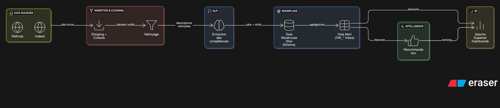
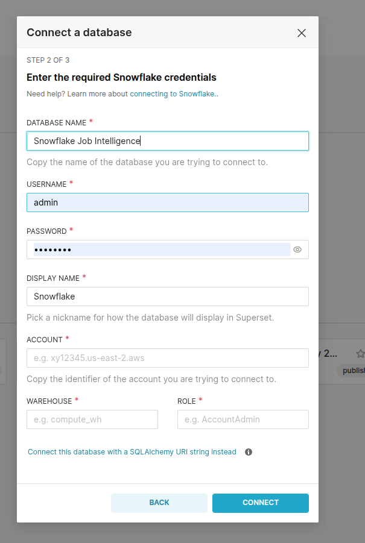
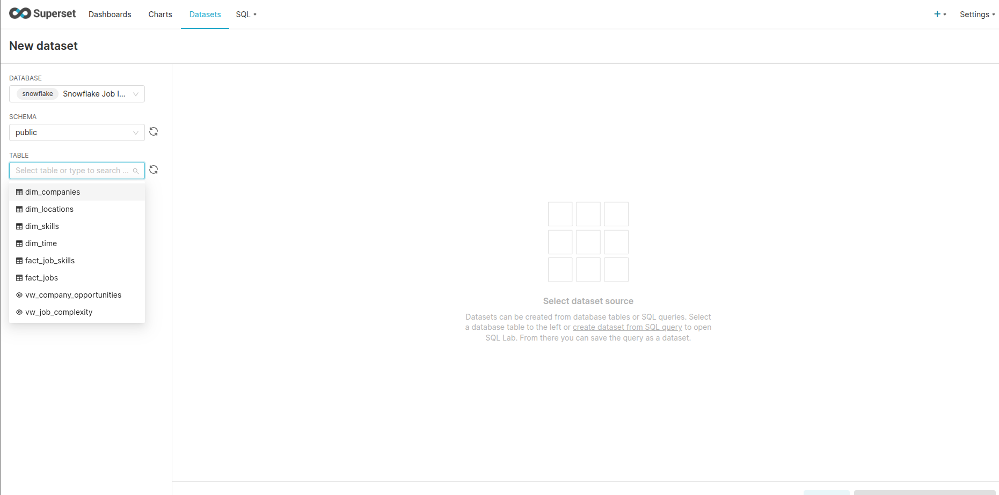
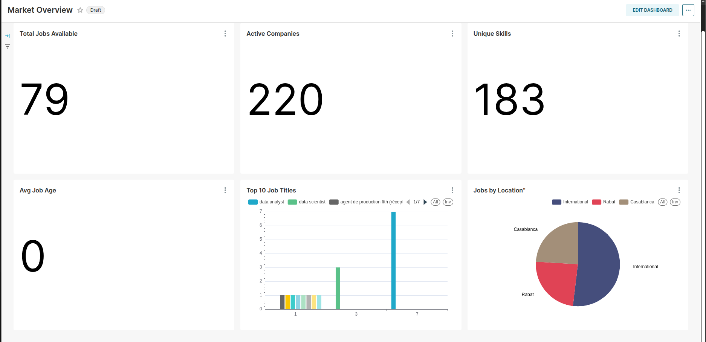
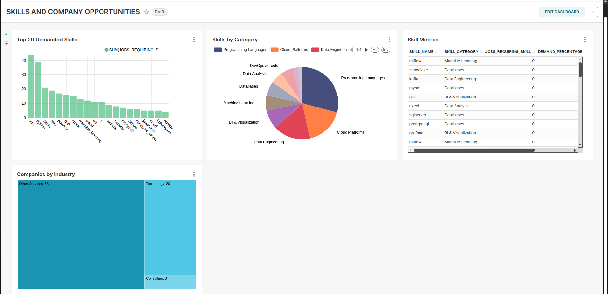
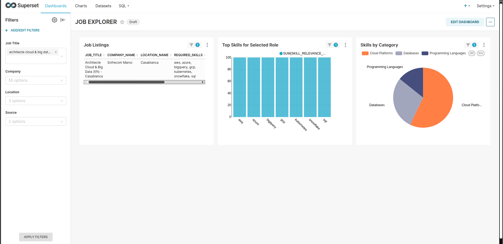

# Job Intelligent

Job Intelligent est une plateforme d'analyse du marché de l'emploi (orientée Data/ML) couvrant le pipeline complet : collecte d'offres, nettoyage, extraction de compétences, stockage Snowflake, vues BI, recommandation et tableaux de bord.

## Architecture



## Objectif

Le projet vise à centraliser des offres Data/ML issues de plusieurs sources, à en extraire automatiquement les compétences demandées, puis à fournir des indicateurs et des visualisations (Superset) ainsi qu'une couche de recommandation.

## Modules

- Ingestion : scrapers Indeed et ReKrute (src/ingestion)
- Processing : nettoyage et normalisation des offres (src/processing)
- NLP : extraction de compétences (src/nlp)
- Data Warehouse : schéma étoile et chargement Snowflake (scripts + src/database)
- Data Mart : vues BI VW_* (scripts/snowflake_datamart.sql)
- Recommandation : matching compétences + similarité sémantique (src/recommandation)
- BI : Apache Superset (docker-compose.yml)

## Données produites

Les exécutions génèrent principalement des fichiers CSV dans `data/` (exemples) :

- `data/indeed_jobs.csv`, `data/rekrute_jobs.csv` : exports bruts
- `data/jobs_cleaned.csv` : dataset unifié nettoyé
- `data/jobs_skills.csv` : extraction des compétences par offre
- `data/candidate_recommendations.csv` : recommandations générées

## Prérequis

- Python 3.10+
- Un compte Snowflake (si vous voulez charger et requêter dans Snowflake)
- Docker + Docker Compose (pour Superset)

## Démarrage rapide

### 1) Installer les dépendances

```bash
python -m venv .venv
source .venv/bin/activate
pip install -r requirements.txt
```

### 2) Configurer Snowflake (optionnel)

Créer un fichier `.env` à la racine du projet :

```bash
SNOWFLAKE_ACCOUNT=...
SNOWFLAKE_USER=...
SNOWFLAKE_PASSWORD=...
SNOWFLAKE_WAREHOUSE=COMPUTE_WH
SNOWFLAKE_DATABASE=JOB_INTELLIGENT
SNOWFLAKE_SCHEMA=PUBLIC
SNOWFLAKE_ROLE=ACCOUNTADMIN
```

### 3) Exécuter le pipeline (CSV -> Snowflake)

1. Collecter les offres (Indeed/ReKrute) et générer les exports CSV.
2. Nettoyer et normaliser le dataset (jobs_cleaned.csv).
3. Extraire les compétences (jobs_skills.csv).
4. Créer le schéma Snowflake : `scripts/snowflake_schema.sql`.
5. Charger les données dans Snowflake :

```bash
python src/database/snowflake_loader.py
```

6. Créer les vues BI (data mart) : `scripts/snowflake_datamart.sql`.

## Superset (BI)

```bash
docker compose up -d
./superset_init.sh
```

Superset est ensuite accessible sur `http://localhost:8088`.

## Captures (Superset)

Connexion Snowflake :



Création de dataset :



Exemples de dashboards :






